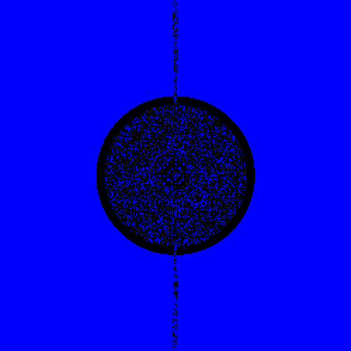

# Schwarzschild Ray Tracer

**Simulating gravitational lensing and photon trajectories in Schwarzschild spacetime using inverse ray tracing and general relativity.**

## 📜 Overview

This project numerically integrates null geodesics to simulate how light bends around a non-rotating Schwarzschild black hole. By back-tracing rays from an observer's camera through curved spacetime, we recreate gravitational lensing, photon rings, and black hole shadows.

The final output demonstrates how black holes appear to distant observers—mimicking features captured in telescope imagery and theoretical models.

---

## Key Features

- **Geodesic Integration**: Solves the null geodesic equations using a symplectic integrator (`FANTASY` via EinsteinPy)
- **GPU Acceleration**: Massive speedup through Numba-CUDA support
- **Realistic Rendering**: Projects a background panorama to simulate lensing distortions
- **Schwarzschild Geometry**: Pure Schwarzschild spacetime with no spin
- **Equirectangular Mapping**: Converts escape directions to texture coordinates on a celestial sphere

---

##  Technical Details

- **Metric**: Schwarzschild (static, spherically symmetric)
- **Observer**: Positioned far from the black hole on the +x axis
- **Resolution**: Configurable grid of rays (e.g., 400×400)
- **Integration**: Symplectic solver using affine parameter $\lambda$
- **Output**: Rendered RGB image combining captured rays and background sky

